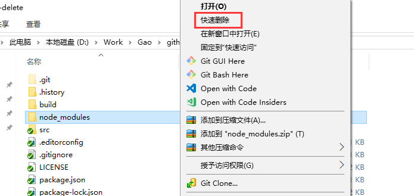

# fast-delete
利用 [rimraf](https://www.npmjs.com/package/rimraf) 模块，实现快速删除 node_modules、Android 项目等一些目录结构比较深或小文件比较多的文件夹，比Windows自带删除快多倍。
## 使用环境
* windows 系统
* [node.js](https://nodejs.org)，推荐 14+ 版本
* [pnpm](https://pnpm.io/)

## 使用说明
* 未安装 `pnpm` 需要先执行 `npm install -g pnpm`
* 首次使用，在项目根目录执行 ```pnpm install``` 命令或直接运行 ```install.bat``` ，会在根目录生成 ```build``` 注册表文件
```
-build
  -install.reg 添加注册表
  -install-close.reg 添加注册表(删除后关闭cmd窗口)
  -uninstall.reg 删除注册表
```
* 运行 ```install.reg``` 将会添加删除程序到右键菜单，鼠标右键选择要删除的目录就可以在看到"快速删除"功能了; 运行 ```uninstall.reg``` 删除相应的功能
* 在项目根目录打开cmd，执行 ```npm run reg``` 命令生成新的注册表文件
* 无聊的话也可以通过 ```node . 路径1 路径2 ...``` 删除文件
* 喜欢别的名字的，自行修改```build_reg.js```文件



## 感谢
😂 参考了 [itvincent-git/fast-delete](https://github.com/itvincent-git/fast-delete) 同学的实现
